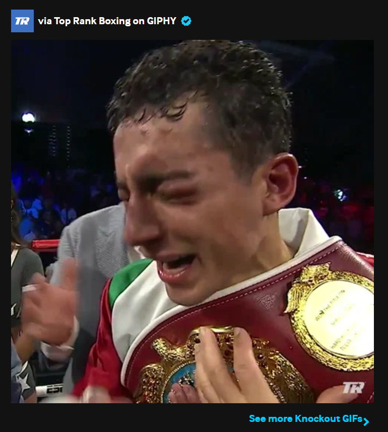
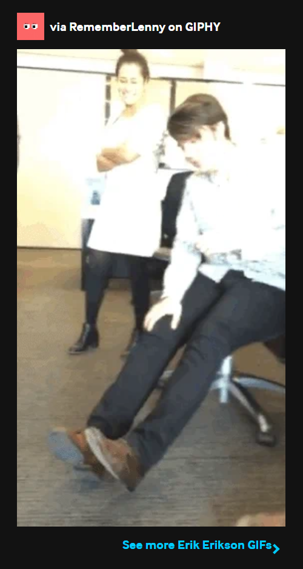
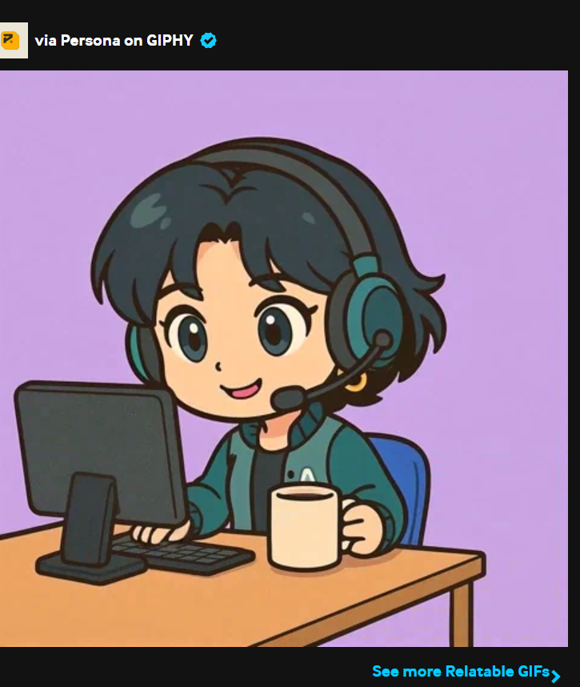
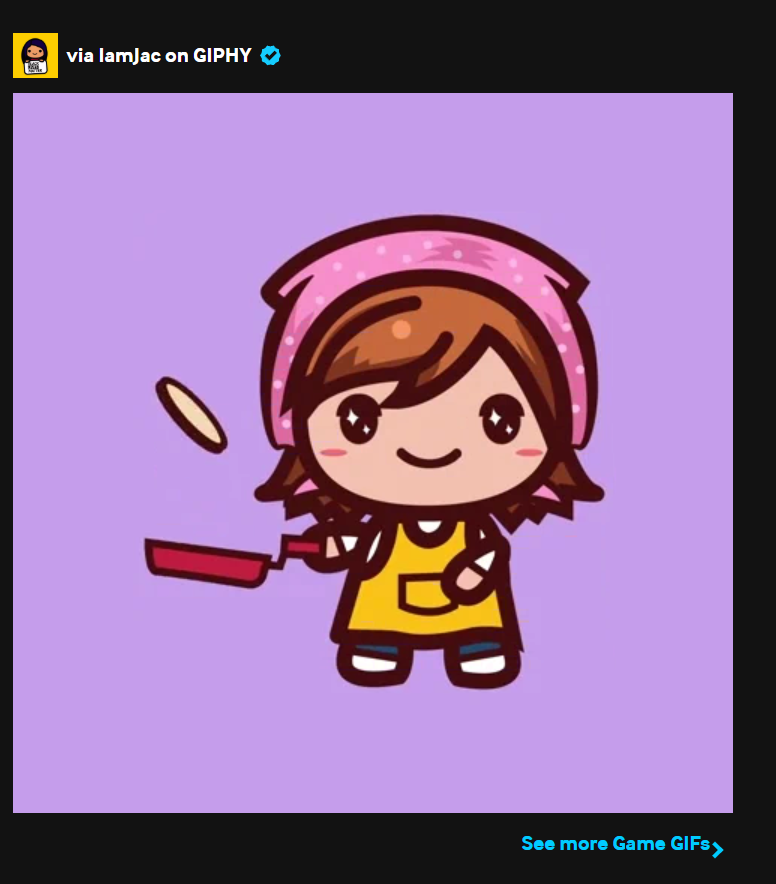

# MWAHAHA: GTVH-Guided Humor Generation Pipeline

> A structured LLM pipeline for **SemEval 2026 Task 1 — MWAHAHA** (*Models Write Automatic Humor And Humans Annotate*), grounded in the **General Theory of Verbal Humor (GTVH)**.

<br>
<table align="center" width="100%">
  <tr>
    <td align="center" width="50%">
      <a href="system%20description%20paper.pdf"><h3>📄 Read the System Description Paper (PDF)</h3></a>
    </td>
    <td align="center" width="50%">
      <a href="#sample-outputs"><h3>✨ Jump to Sample Outputs</h3></a>
    </td>
  </tr>
</table>
<br>

---

## Table of Contents

- [Task Descriptions](#task-descriptions)
- [Overview](#overview)
- [System Architecture](#system-architecture)
  - [Pipeline Modules](#pipeline-modules)
  - [Variation & Selection Strategy](#variation--selection-strategy)
- [Example: DSPy Signatures (Headline Jokes — English)](#example-dspy-signatures-headline-jokes--english)
- [Repository Structure](#repository-structure)
- [Setup & Installation](#setup--installation)
- [Usage](#usage)
  - [CLI Flags Reference](#cli-flags-reference)
  - [Running Modes & Output Directories](#running-modes--output-directories)
  - [GIF Preprocessing (Task B)](#gif-preprocessing-task-b)
  - [Re-Judging Candidates](#re-judging-candidates)
  - [Validating Outputs](#validating-outputs)
- [Configuration](#configuration)
- [Output Format](#output-format)
- [Sample Outputs](#sample-outputs)

---

## Task Descriptions

### Task A — Text-Based Humor

**A1 (Headlines):** Given a news headline, generate a joke inspired by or referencing it.  
**A2 (Word Inclusion):** Given two words (e.g., `drill` and `book`), write a joke that naturally includes both.

Supported languages: English (300 samples), Spanish (300 samples), Chinese (300 samples).

### Task B — Multimodal Humor (GIFs)

**B1 (GIF Caption):** Given only a GIF URL, write a funny caption (≤20 words).  
**B2 (GIF + Prompt):** Given a GIF and a fill-in-the-blank prompt, complete it humorously.

GIFs are first converted into textual descriptions using **Gemini 2.5 Flash Lite** (vision model) via GIF → MP4 conversion, then fed into the text-based pipeline.

### Constraints

- **English/Spanish:** Max 900 characters per joke  
- **Chinese:** Max 300 characters per joke  
- **B1 captions:** Max 20 words

---

## Overview

This system generates humorous text across five subtasks:

| Subtask | Input | Language | Description |
|---------|-------|----------|-------------|
| **A1** | News headline | EN / ES / ZH | Write a joke based on the headline |
| **A2** | Two words | EN / ES / ZH | Write a joke that naturally includes both words |
| **B1** | GIF URL | EN | Write a funny caption for the GIF |
| **B2** | GIF URL + prompt | EN | Complete a humorous fill-in-the-blank prompt |

The pipeline decomposes joke generation into five sequential modules inspired by the six GTVH Knowledge Resources (Situation, Target, Logical Mechanism, Script Opposition, Narrative Strategy, and Language). Each module is implemented as a [DSPy](https://dspy.ai) `Signature` with explicitly typed inputs and outputs, ensuring structured, reproducible generation.

**Default model:** `google/gemma-3-27b-it` via OpenRouter (bf16 quantization).

---

## System Architecture

```
                          ┌─────────────────────┐
                          │   Input (headline,  │
                          │   words, or GIF)    │
                          └─────────┬───────────┘
                                    │
                          ┌─────────▼───────────┐
                          │  1. ContextEnricher │  ← Shared across all branches
                          │  (The Analyst)      │
                          └─────────┬───────────┘
                                    │
              ┌─────────────────────┼─────────────────────┐
              │                     │                     │           (4 parallel branches)
    ┌─────────▼─────────┐ ┌────────▼──────────┐ ┌────────▼──────────┐
    │ 2. HumorArchitect │ │ 2. HumorArchitect │ │ 2. HumorArchitect │  ...
    │ (variation 1)     │ │ (variation 2)     │ │ (variation 3)     │
    └─────────┬─────────┘ └────────┬──────────┘ └────────┬──────────┘
              │                     │                     │
    ┌─────────▼──────────┐ ┌───────▼───────────┐ ┌───────▼───────────┐
    │ 3. DeliveryStrat.  │ │ 3. DeliveryStrat. │ │ 3. DeliveryStrat. │  ...
    └─────────┬──────────┘ └───────┬───────────┘ └───────┬───────────┘
              │                     │                     │
    ┌─────────▼──────────┐ ┌───────▼───────────┐ ┌───────▼───────────┐
    │  4. ContentWriter  │ │  4. ContentWriter │ │  4. ContentWriter │  ...
    └─────────┬──────────┘ └───────┬───────────┘ └───────┬───────────┘
              │                     │                     │
              └─────────────────────┼─────────────────────┘
                                    │
                          ┌─────────▼───────────┐
                          │   5. HumorJudge     │  ← Tournament bracket
                          │   (The Critic)      │     (pairwise comparison)
                          └─────────┬───────────┘
                                    │
                          ┌─────────▼───────────┐
                          │   Winning Joke      │
                          └─────────────────────┘
```

### Pipeline Modules

| # | Module | Role | GTVH Resource | Key Outputs |
|---|--------|------|---------------|-------------|
| 1 | **ContextEnricher** | The Analyst | Situation, Target | `situation`, `semantic_associations` |
| 2 | **HumorArchitect** | The Brain | Logical Mechanism, Script Opposition | `focal_targets`, `cognitive_manipulation`, `logical_mechanism`, `expected_script`, `opposing_script`, `script_opposition` |
| 3 | **DeliveryStrategist** | The Director | Narrative Strategy | `strategic_analysis`, `narrative_strategy`, `language_style` |
| 4 | **ContentWriter** | The Artist | Language | `draft_setup`, `draft_punchline`, `final_joke` |
| 5 | **HumorJudge** | The Critic | — | `critique`, `better_joke` (Literal: "Joke 1" or "Joke 2") |

### Variation & Selection Strategy

For each input item, the pipeline generates **4 candidate jokes** by running 4 parallel branches through Modules 2–4. All branches share the same Module 1 context output.

The 4 candidates are then evaluated via a **single-elimination tournament bracket**:
1. **Semi-final 1:** Candidate 1 vs. Candidate 2 (run in parallel with Semi-final 2)
2. **Semi-final 2:** Candidate 3 vs. Candidate 4
3. **Final:** Winner of SF1 vs. Winner of SF2

This produces one winning joke per input.

---

## Example: DSPy Signatures (Headline Jokes — English)

Each module is a `dspy.Signature` class with typed `InputField`s and `OutputField`s. Below are the five signatures used for Task A1 (headline-based jokes in English). The other subtask signatures (`signatures_A2.py`, `signatures_B1.py`, `signatures_B2.py`) follow the same 5-module structure with task-specific prompts.

<details>
<summary><b>Module 1: ContextEnricher</b> — Extracts factual subtext and cultural context</summary>

```python
class ContextEnricher(dspy.Signature):
    """
    Analyzes a news headline to extract the factual subtext, implicit assumptions,
    and cultural context required to construct a grounded joke.

    Role: You are a comedy researcher analyzing the raw material before writing.
    Goal: Identify the 'Situation' and potential targets without trying to write 
          the joke yet, just setup the background.
    """
    # Inputs
    original_input: str = dspy.InputField(
        desc="The news headline to be analyzed."
    )
    target_language_and_culture: Literal["English", "Spanish", "Chinese"] = dspy.InputField(
        desc="The target language and cultural context for joke generation."
    )
    # Outputs
    situation: str = dspy.OutputField(
        desc="Elaborate on the headline. Explain the factual reality and subtext. "
             "What is actually happening? What are the unsaid implications?"
    )
    semantic_associations: list[str] = dspy.OutputField(
        desc="List specific stereotypes, properties, cultural references, or "
             "associations linked to the key terms of the headline."
    )
```

</details>

<details>
<summary><b>Module 2: HumorArchitect</b> — Designs the GTVH structural blueprint</summary>

```python
class HumorArchitect(dspy.Signature):
    """
    Deconstructs the context into a formal GTVH structural blueprint.

    Role: You are the Logic Engine and Lead Comedy Writer. You do not write the 
          final prose; you design the cognitive mechanism that makes the joke work.
    Goal: Define the abstract 'Script Opposition' (SO) and 'Logical Mechanism' (LM)
          that will serve as the core DNA of the joke.
    """
    # Inputs
    original_input: str = dspy.InputField(desc="The original headline.")
    situation: str = dspy.InputField(desc="The grounded reality and context.")
    semantic_associations: list[str] = dspy.InputField(desc="Cultural references and associations.")
    target_language_and_culture: Literal["English", "Spanish", "Chinese"] = dspy.InputField(...)

    # Outputs
    focal_targets: str = dspy.OutputField(
        desc="The specific 'Hinge' concepts — which words, persons, or ideas "
             "will be the pivot points of the joke."
    )
    cognitive_manipulation: str = dspy.OutputField(
        desc="A precise, one-sentence instruction on how to twist the focal targets."
    )
    logical_mechanism: str = dspy.OutputField(
        desc="The GTVH Label. Examples: [False Analogy, Literal Interpretation, "
             "Role Reversal, Exaggeration, Garden Path, Juxtaposition, ...]."
    )
    expected_script: str = dspy.OutputField(
        desc="The 'Normal' expectation the reader has when reading the setup."
    )
    opposing_script: str = dspy.OutputField(
        desc="The 'Abnormal' reality revealed by the punchline."
    )
    script_opposition: str = dspy.OutputField(
        desc="Format: [Concept A] vs. [Concept B]."
    )
```

</details>

<details>
<summary><b>Module 3: DeliveryStrategist</b> — Chooses format and voice</summary>

```python
class DeliveryStrategist(dspy.Signature):
    """
    Determines the best Narrative Strategy and Language to deliver the humor.

    Role: You are a Comedy Director. You analyze the logic and decide *how* to perform it.
    Goal: Ensure the delivery format supports the Logical Mechanism.
    """
    # Inputs
    original_input: str = dspy.InputField(...)
    situation: str = dspy.InputField(...)
    focal_targets: str = dspy.InputField(...)
    logical_mechanism: str = dspy.InputField(...)
    script_opposition: str = dspy.InputField(...)
    target_language_and_culture: Literal["English", "Spanish", "Chinese"] = dspy.InputField(...)

    # Outputs
    strategic_analysis: str = dspy.OutputField(
        desc="Why would one format work better than another for this specific logic?"
    )
    narrative_strategy: str = dspy.OutputField(
        desc="Examples: [Dialogue, Fake News Snippet, One-Liner, Q&A, Breaking News, ...]."
    )
    language_style: str = dspy.OutputField(
        desc="Examples: [Dry/Cynical, Deadpan, Sarcastic, Hyperbolic/Excited, ...]."
    )
```

</details>

<details>
<summary><b>Module 4: ContentWriter</b> — Generates the final joke</summary>

```python
class ContentWriter(dspy.Signature):
    """
    Executes the joke generation based on strict GTVH constraints.

    Role: You are a Comedy Writer taking the blueprint and writing the final prose.
    Goal: Write a joke that lands the specific 'Script Opposition' using the 
          chosen 'Voice' and 'Strategy'.
    """
    # Inputs (receives all upstream outputs + writing_guidelines)
    original_input: str = dspy.InputField(...)
    situation: str = dspy.InputField(...)
    focal_targets: str = dspy.InputField(...)
    cognitive_manipulation: str = dspy.InputField(...)
    logical_mechanism: str = dspy.InputField(...)
    script_opposition: str = dspy.InputField(...)
    strategic_analysis: str = dspy.InputField(...)
    narrative_strategy: str = dspy.InputField(...)
    language_style: str = dspy.InputField(...)
    target_language_and_culture: Literal["English", "Spanish", "Chinese"] = dspy.InputField(...)
    writing_guidelines: str = dspy.InputField(
        desc="Language-specific guidelines for writing effective jokes."
    )

    # Outputs
    draft_setup: str = dspy.OutputField(desc="The build-up. Establish the 'Expected Script'.")
    draft_punchline: str = dspy.OutputField(desc="The reveal. Switch to the 'Opposing Script'.")
    final_joke: str = dspy.OutputField(desc="The complete, polished joke text.")
```

The `writing_guidelines` input provides language-specific rules for crafting effective jokes. For English (Task A1), the full writing tips are:

> **ECONOMY OF LANGUAGE:** Cut every unnecessary word. If you can say it in 5 words instead of 10, do it. The funniest jokes are lean and mean.
>
> **SETUP MISDIRECTION:** The setup should read like a normal observation about the headline, NOT like "here comes a joke." Make it feel organic.
>
> **SURPRISE + INEVITABILITY:** The punchline should be unexpected yet feel obvious in retrospect. "I didn't see it coming, but of course!"
>
> **NO EXPLAINING:** Never explain the joke. If the punchline needs clarification, rewrite it. The reveal should be instant.
>
> **CONCRETE > ABSTRACT:** "He ate 47 pancakes" is funnier than "He ate a lot of pancakes." Specific numbers, names, and details land harder.
>
> **RHYTHM IS REAL:** The joke should have natural flow and cadence. The punchline should arrive at exactly the right moment.
>
> **TRUTH RESONATES:** The best comedy contains truth. People laugh when they recognize something real about the headline's subject.
>
> **CONVERSATIONAL TONE:** Write how people actually talk (unless the voice demands otherwise). Avoid academic or robotic phrasing.
>
> **COMMIT TO THE BIT:** Whatever voice/style you choose, go all in. Half-committed jokes fall flat.
>
> **Red Flags** (usually means the joke fails): Explaining the joke after the punchline; using "because" after the reveal; formulaic template-generated structure; punchline that's just "imagine if X was Y" without actual wit; generic jokes that could apply to any headline; words that break the rhythm or flow.

Equivalent writing tips are defined in each language and task variant (Spanish, Chinese, Task A2, Task B1, Task B2).

</details>

<details>
<summary><b>Module 5: HumorJudge</b> — Pairwise tournament selection</summary>

```python
class HumorJudge(dspy.Signature):
    """
    Evaluates two jokes in a pairwise comparison.

    Role: You are an expert comedy critic. Pick the joke that would get the bigger 
          laugh from a real human audience, not the one that sounds more "correct."
    """
    # Inputs
    original_input: str = dspy.InputField(desc="The original headline.")
    joke_candidate_1: str = dspy.InputField(desc="Option A.")
    joke_candidate_2: str = dspy.InputField(desc="Option B.")
    target_language_and_culture: Literal["English", "Spanish", "Chinese"] = dspy.InputField(...)
    evaluation_criteria: str = dspy.InputField(
        desc="Language-specific evaluation framework for judging humor quality."
    )

    # Outputs
    critique: str = dspy.OutputField(desc="Analyze both jokes. Highlight strengths and weaknesses.")
    better_joke: Literal["Joke 1", "Joke 2"] = dspy.OutputField(desc="The winner.")
```

The `evaluation_criteria` input provides a structured framework for judging humor quality. For English (Task A1), the full evaluation criteria are:

> 1. **THE LAUGH TEST:** Which joke would actually make someone laugh, smile, or react? Not which is "clever" — which is FUNNY?
> 2. **SURPRISE & SETUP:** Does the punchline genuinely surprise while still making sense? Or is it telegraphed/predictable?
> 3. **ECONOMY:** Is every word necessary? Excess words kill momentum. Tighter is almost always better.
> 4. **HEADLINE RELEVANCE:** Does it actually connect to THIS specific headline, or is it a generic joke slapped on top?
> 5. **NATURALNESS:** Does it sound like something a human would say? Or is it stiff, forced, or trying too hard?
> 6. **LOGICAL PUNCHLINE:** Does the punchline make sense? Absurdity is fine, but illogical nonsense isn't funny.
> 7. **TRUTH/RECOGNITION:** Do people recognize something real in it? The best jokes contain truth about the headline's subject.
> 8. **COMMITMENT:** Does it fully commit to the bit, or does it hedge/explain itself?
>
> **Automatic Failures:** Joke explains itself after the punchline; could be about literally any headline (not specific enough); offensive without being clever; setup and punchline don't connect logically.

Equivalent evaluation criteria are defined in each language and task variant.

</details>

---

## Repository Structure

```
├── main.py                  # CLI entry point — orchestrates all tasks
├── pipeline.py              # Core UnifiedHumorPipeline (DSPy module)
├── api.py                   # LLM provider abstraction (Gemini, OpenRouter)
├── config.py                # Centralized configuration
├── data_loader.py           # TSV I/O, resume support, data structures
├── gif_analyzer.py          # GIF→MP4→text description via Gemini vision
├── validators.py            # Word inclusion & character limit checks
├── logger.py                # Structured colored logging
├── utils.py                 # Token usage extraction utilities
│
├── signatures_A1.py         # DSPy Signatures: headline jokes (EN/ES/ZH)
├── signatures_A2.py         # DSPy Signatures: word-inclusion jokes (EN/ES/ZH)
├── signatures_B1.py         # DSPy Signatures: GIF captions (EN)
├── signatures_B2.py         # DSPy Signatures: GIF+prompt completion (EN)
│
├── judge.py                 # Standalone re-judging script
├── preprocess_gifs.py       # Standalone GIF preprocessing script
├── validate_outputs.py      # Output validation & fixing for submission
│
├── .env                     # API keys (not committed)
├── requirements.txt         # Python dependencies
├── task.md                  # Official task format specification
├── gemini_ablation_prompts.md  # Ablation baseline prompts
│
├── Input/                   # Raw task input TSVs
├── test_outputs/            # Winning jokes — test mode runs
├── outputs/                 # Winning jokes — full mode runs (--full)
├── complete/                # All 4 candidates + module traces (--complete)
│   ├── full/                #   Full dataset results
│   └── test/                #   Test subset results
├── judged_outputs/          # Re-judged winners (--judge)
├── preprocessed/            # Cached GIF text descriptions
├── logs/                    # Timestamped run logs
└── Images/                  # Architecture diagrams
```

---

## Setup & Installation

### Prerequisites

- Python 3.10+
- `ffmpeg` (required for GIF → MP4 conversion in Task B)

### Install

```bash
git clone <repository-url>
cd <repository-directory>
pip install -r requirements.txt
```

### API Keys

Create a `.env` file in the project root:

```env
# Required — at least one provider
GEMINI_API_KEY=your-gemini-api-key-here
OPENROUTER_API_KEY=your-openrouter-api-key-here

# Optional — defaults to "openrouter"
API_PROVIDER=openrouter
```

- **OpenRouter** (default): Provides access to `google/gemma-3-27b-it` and other models. Get a key at [openrouter.ai](https://openrouter.ai).
- **Gemini**: Google's API. Get a key at [aistudio.google.com](https://aistudio.google.com).

---

## Usage

### CLI Flags Reference

| Flag | Description |
|------|-------------|
| `--task {a-en,a-es,a-zh,b1,b2,all}` | Which task to run. Default: `all` |
| `--full` | Full mode — process the entire dataset. Without this flag, runs in **test mode** (2 items for Task A, 1 for Task B) |
| `--complete` | Save **all 4 candidates** per item plus full intermediate module outputs (JSONL). Without this flag, only the winning joke is saved |
| `--resume` | Resume from where a previous run left off (skips already-processed IDs). Only works with `--full` |
| `--parallel N` / `-p N` | Process N items concurrently (default: 1, max: 8). Higher values are faster but increase rate-limit risk |
| `--provider {gemini,openrouter}` | Override the API provider for this run |
| `--default-provider {gemini,openrouter}` | Set the default provider for models without an explicit provider prefix |
| `--judge` | **Judge-only mode** — skips generation entirely. Loads previously saved candidates from `complete/` and re-runs the tournament judge |

### Running Modes & Output Directories

The pipeline has several distinct modes, each writing to a different output directory:

#### 1. Test Mode (default)

```bash
python main.py --task a-en
```

Processes a small subset (2 headline + 2 word-inclusion items for Task A, 1 item for Task B). Outputs the **winning joke only** to:

```
test_outputs/
└── task-a-en.tsv          # id → winning joke (TSV, 2 columns)
```

#### 2. Full Mode

```bash
python main.py --task a-en --full
python main.py --task a-en --full --resume        # resume interrupted run
python main.py --task a-en --full --parallel 4     # 4 items concurrently
```

Processes the entire dataset (e.g., all 300 samples for Task A English). Outputs the **winning joke only** to:

```
outputs/
└── task-a-en.tsv          # id → winning joke (TSV, 2 columns)
```

#### 3. Complete Mode (`--complete`)

```bash
python main.py --task a-en --full --complete
python main.py --task a-en --complete              # test + complete
```

Saves **all 4 candidates** and the full intermediate module outputs (context, architecture, strategy, content) for every item. This is essential for analysis and for later re-judging. Writes to:

```
complete/
├── full/                                  # when used with --full
│   ├── task-a-en_complete.tsv             # all 4 candidates per item + is_winner flag
│   └── task-a-en_llm_outputs.jsonl        # full module traces (one JSON object per line)
└── test/                                  # when used without --full
    ├── task-a-en_complete.tsv
    └── task-a-en_llm_outputs.jsonl
```

The `_complete.tsv` contains columns: `id`, `candidate_num`, `is_winner`, `joke`.  
The `_llm_outputs.jsonl` contains the full pipeline trace for each item — all 4 candidates with their `context`, `architecture`, `strategy`, and `content` module outputs.

> **Note:** `--complete` also writes the winning joke to `outputs/` or `test_outputs/` as usual.

#### 4. Judge-Only Mode (`--judge`)

```bash
python main.py --judge --full                     # re-judge all tasks from complete/full
python main.py --judge --full --task a-en          # re-judge Task A English only
python main.py --judge                             # re-judge from complete/test
```

Loads candidates from `complete/{test,full}/{task}_llm_outputs.jsonl`, validates constraints (word inclusion via flexible regex, character limits), runs a **fresh tournament** using the HumorJudge module, and writes the new winners to:

```
judged_outputs/
├── full/
│   └── task-a-en.tsv      # id → re-judged winning joke
└── test/
    └── task-a-en.tsv
```

This allows re-judging with a different model or temperature without regenerating all candidates.

#### 5. GIF Preprocessing (`preprocess_gifs.py`)

A standalone script that must be run **before** Task B generation. It downloads GIFs, converts them to MP4 via `ffmpeg`, sends them to a vision model, and caches the textual descriptions:

```bash
python preprocess_gifs.py --task b1
python preprocess_gifs.py --task b2
```

Output:

```
preprocessed/
├── task-b1-preprocessed.tsv    # id → GIF text description
└── task-b2-preprocessed.tsv
```

The main pipeline automatically loads these cached descriptions when processing Task B items.

#### 6. Output Validation (`validate_outputs.py`)

Validates generated TSVs against submission requirements (correct IDs, ordering, character/word limits) and can auto-fix minor issues:

```bash
python validate_outputs.py
```

### Output Directory Summary

| Directory | Written by | Contents |
|-----------|-----------|----------|
| `test_outputs/` | Default run (no `--full`) | Winning joke per item (TSV) |
| `outputs/` | `--full` run | Winning joke per item (TSV) |
| `complete/{test,full}/` | `--complete` flag | All 4 candidates + full module traces (TSV + JSONL) |
| `judged_outputs/{test,full}/` | `--judge` flag | Re-judged winning jokes (TSV) |
| `preprocessed/` | `preprocess_gifs.py` | Cached GIF text descriptions (TSV) |
| `logs/` | Every run | Timestamped log files |

---

## Configuration

All configuration is centralized in `config.py`. Key settings:

| Setting | Default | Description |
|---------|---------|-------------|
| `DEFAULT_MODEL` | `google/gemma-3-27b-it` | LLM model identifier |
| `DEFAULT_PROVIDER` | `openrouter` | API provider (`gemini` or `openrouter`) |
| `NUM_ARCHITECT_VARIATIONS` | `4` | Number of parallel candidate branches |
| `NUM_STRATEGY_VARIATIONS` | `1` | Strategy variations per architect branch |
| `MAX_CHARS_EN` / `MAX_CHARS_ES` | `900` | Character limit for English/Spanish |
| `MAX_CHARS_ZH` | `300` | Character limit for Chinese |
| `TEST_LIMITS` | `task_a: 2, task_b1: 1, task_b2: 1` | Items per task in test mode |

Per-module LLM parameters can be configured in `MODULE_CONFIG` within `config.py`. By default, all per-module parameters are commented out, so the pipeline uses the model's default settings. To customize, uncomment and adjust:

```python
MODULE_CONFIG = {
    "ContextEnricher": {
        "params": {
            # "temperature": 0.5,   # Lower for accurate extraction
            # "max_tokens": 1024,
        },
    },
    "HumorArchitect": {
        "params": {
            # "temperature": 1.0,   # Higher for creative humor angles
            # "presence_penalty": 0.3,
        },
    },
    # ... DeliveryStrategist, ContentWriter, HumorJudge
}
```

Each module can also use a different model/provider by adding a `"model"` key (e.g., `"model": "gemini/gemma-3-27b-it"`).

---

## Output Format

### Submission TSV

Tab-separated file with two columns, as required by the shared task:

```
id	text
en_2001	Breaking: The Associated Press is reporting...
en_2002	Q: What makes Liverpool's summer spending...
```

### Complete Output (JSONL)

When running with `--complete`, full pipeline traces are saved to `complete/{test,full}/{task}_llm_outputs.jsonl`. Each line is a JSON object containing all 4 candidates with their intermediate module outputs, enabling analysis of the generation process and later re-judging:

```json
{
  "id": "en_2001",
  "original_input": "Panamanian lawmakers' Taiwan trip sparks diplomatic row with China",
  "task_type": "a1",
  "language": "en",
  "winner_joke": "...",
  "judged": true,
  "candidates": [
    {
      "candidate_num": 1,
      "joke": "...",
      "is_winner": true,
      "module_outputs": {
        "context": { "situation": "...", "semantic_associations": [...] },
        "architecture": { "focal_targets": "...", "logical_mechanism": "...", "script_opposition": "..." },
        "strategy": { "narrative_strategy": "...", "language_style": "..." },
        "content": { "draft_setup": "...", "draft_punchline": "...", "final_joke": "..." }
      }
    },
    { "candidate_num": 2, "joke": "...", "is_winner": false, "module_outputs": { ... } },
    { "candidate_num": 3, "joke": "...", "is_winner": false, "module_outputs": { ... } },
    { "candidate_num": 4, "joke": "...", "is_winner": false, "module_outputs": { ... } }
  ]
}
```

---

## Sample Outputs

Below are examples of system-generated jokes compared with a Gemini 3 Pro baseline (single-prompt, no GTVH decomposition).

### Task A1 — Headline-Based Jokes

| Headline | System (GTVH Pipeline) | Gemini 2.5 Pro Baseline |
|----------|----------------------|-------------------------|
| *Why an AI 'godfather' is quitting Meta after 12 years* | Breaking: Meta's Chief AI Scientist, Yann LeCun — widely known as the "Godfather of AI" — is reportedly leaving the company after 12 years. Sources say he's citing a desire to "explore new opportunities." Apparently, those opportunities involve a witness protection program and a very convincing new identity. | The AI godfather left Meta because he finally realized "The Social Network" wasn't a training manual for a benevolent deity. He's now looking for a job with less data-mining and more actual wine—turns out, turning water into algorithms is just exhausting for the soul. |
| *Carra: Liverpool must sign in January - even after summer spending spree* | Reporter: Jamie Carragher says Liverpool need to sign players in January, despite a huge summer spending spree. Thoughts? Carragher: Look, I just… I saw a really good deal on a winger, and then a centre-back was on sale. It's an addiction, alright? I need help. | Liverpool's board is terrified. They spent millions this summer, yet Jamie Carragher is still demanding more signings. At this point, it's not about the league title; they just need to buy enough players to physically block Jamie from entering the TV studio. |

### Task A2 — Word-Inclusion Jokes

| Words | System (GTVH Pipeline) | Gemini 2.5 Pro Baseline |
|-------|----------------------|-------------------------|
| *shake*, *chair* | Anchor: "…and the Senator continues to address the nation on the importance of fiscal responsibility. As you can see, he's… quite passionate about the subject." Co-Anchor: "Yes, and it appears his *chair* is equally passionate, actually beginning to *shake* violently. One wonders if it has a stronger opinion on the debt ceiling than he does." | My doctor told me I needed to shake things up to improve my posture. So, I bought a high-tech vibrating office chair. Now, I'm still unproductive, but at least I look like I'm working at the speed of light. |
| *measure*, *fridge* | My doctor said I need to track absolutely everything I eat. I spent twenty minutes this morning trying to accurately *measure* a single Brussels sprout. My wife walked in and asked, "What are you doing?" I said, "Preparing for long-term storage. It's going in the *fridge* and needs to be properly documented for posterity." She just… backed away slowly. | My wife asked me to measure the fridge to see if it would fit in our new kitchen. I told her it was exactly three pizzas wide and two "oops-I-forgot-to-buy-milk" deep. She wasn't amused, but at least I know the scale of my problems. |

### Task B1 — GIF Captions

| GIF | System (GTVH Pipeline) | Gemini 2.5 Pro Baseline |
|-----|----------------------|-------------------------|
|  | Me when winning buys me a summer away from my in-laws. This belt = escape. | Me opening the "Total Due" section of my electric bill after leaving the AC on all summer. |
|  | When you reply-all with a cat GIF and your boss silently drafts your termination. | Me trying to navigate my responsibilities when the weekend is finally in sight. |

### Task B2 — GIF + Prompt Completion

| GIF | Prompt | System (GTVH Pipeline) | Gemini 2.5 Pro Baseline |
|-----|--------|----------------------|-------------------------|
|  | *Logging into a remote call and realizing \_\_\_\_\_\_* | ...I'd accidentally used a potato as my webcam. | ...you're still in your pajamas but the camera is definitely on. |
|  | *First pancake flips like a pro, the rest flip like \_\_\_\_\_\_* | ...an Olympic long jumper. | ...a chaotic kitchen nightmare after Mama's third glass of wine. |
